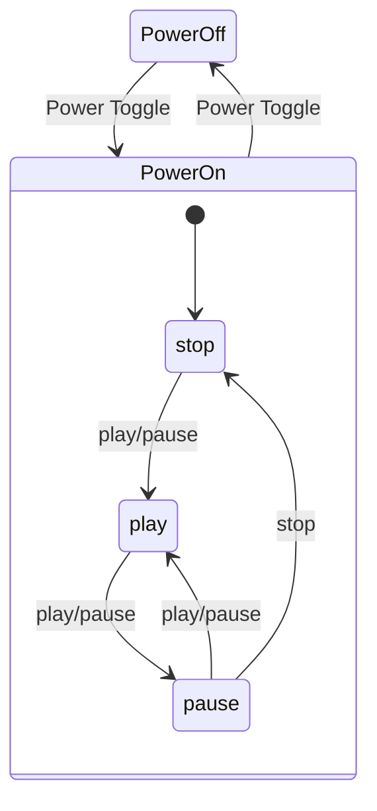
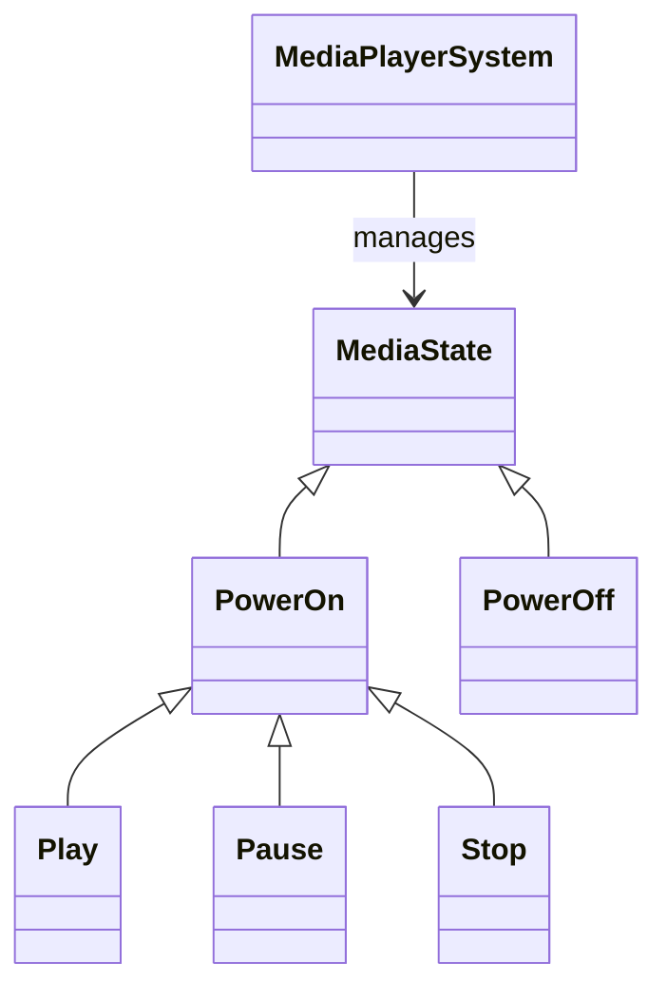

# media_system

A ROS 2 package demonstrating a **Hierarchical State Machine (HSM)** for a media player system. This project showcases modern C++ design patterns and advanced ROS 2 integration for modular, event-driven control.

---

## Overview

This media player system is structured as a hierarchical state machine:

- **Superstate:** Controls device power (On/Off).
- **Substates:** When powered on, the device can be in one of three modes: Playing, Paused, or Stopped.

### State Diagram



---

## Key C++ Techniques

- **Polymorphism & Inheritance:** All states inherit from a common interface for runtime state transitions.
- **Encapsulation:** State logic is modular and extendable.
- **Singleton Pattern:** Each state is a singleton, ensuring only one instance per state.
- **Runtime Resolution:** State transitions are determined dynamically based on user input and current state.

---

## ROS 2 Techniques Used

- **Composable Nodes & Components:** All main nodes are implemented as ROS 2 components, allowing them to be loaded dynamically into containers for efficient resource usage.
- **Pluginlib:** State classes and nodes are registered as plugins, enabling runtime discovery and flexible system composition.
- **Action Server:** The media player system uses a ROS 2 action server to handle asynchronous user commands (play, pause, stop, power toggle).
- **Custom Messages:** Communication between nodes uses a custom `Speaker` message type.
- **Parameterization:** Keyboard controls and other behaviors can be remapped or configured via ROS 2 parameters.

---

## Prerequisites

- ROS 2 (tested with Humble or later)
- Colcon build tool

---

## Building

From the root of your ROS 2 workspace:

```bash
colcon build --packages-select media_system
```

Source your workspace after building:

```bash
source install/setup.bash
```

---

## Running Nodes

### 1. Main System Node

```bash
ros2 run media_system media_system_main
```

### 2. Media Control Node

```bash
ros2 run media_system media_control
```

### 3. Using Launch Files

You can also use the provided launch files:

```bash
ros2 launch media_system <launch_file.py>
```

Replace `<launch_file.py>` with the desired launch file from the `launch/` directory.

---

## Components

- **media_system_main:** Main entry point for the media system.
- **media_control:** Node to control the media system via keyboard.
- **media_player_system:** Shared library with media player states and transitions.
- **media_listener:** Node to listen to media events and print state changes.

---

## System Structure

- The main interface is established through the `MediaState` and `MediaPlayerSystem` classes.
- The superstate consists of two states: *Power Off* and *Power On*.
- When powered on, the media player subsystem always starts in the *Stopped* state.
- The *Power On* state shares its interface with the substates (Playing, Paused, Stopped) through inheritance.

### Class Diagram



---

## Notes

- Always source your workspace before running any nodes.
- For custom message and action interfaces, ensure dependencies are built.
- Keyboard controls can be remapped via ROS 2 parameters.
- Nodes can be run as standalone executables or loaded as components into a container for improved efficiency.

---

## License

MIT License

---

## Author

Michele Di Lecce  
michele.dilecce@hotmail.com
